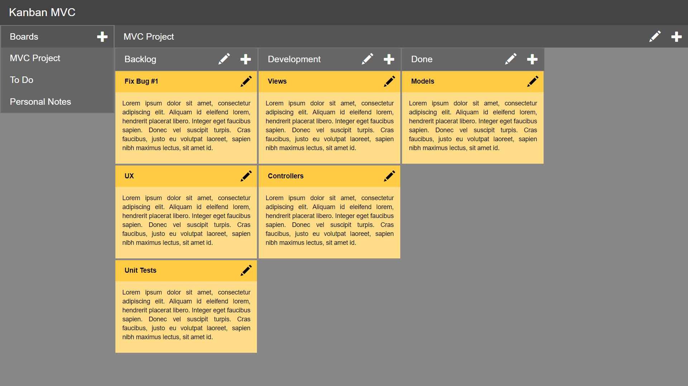
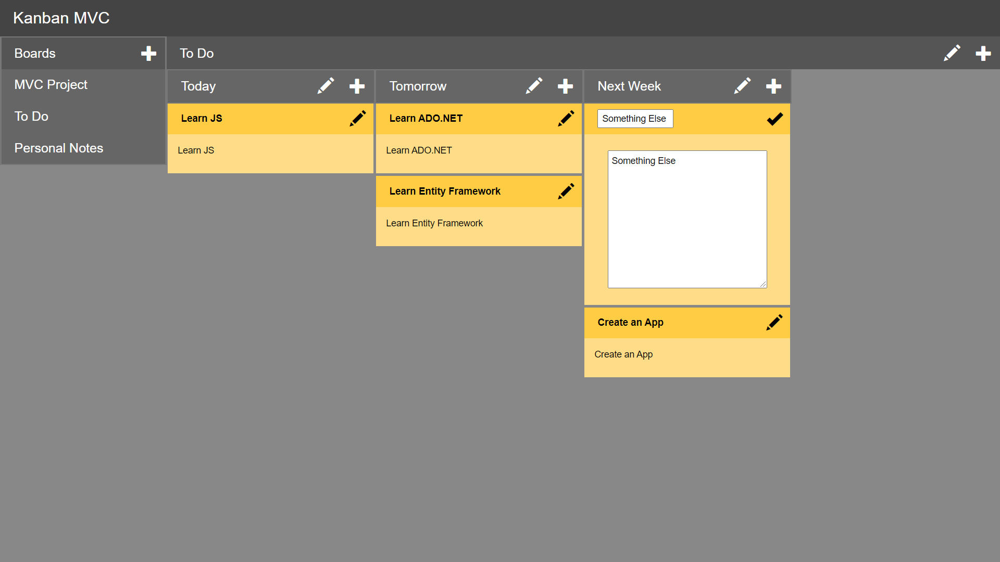
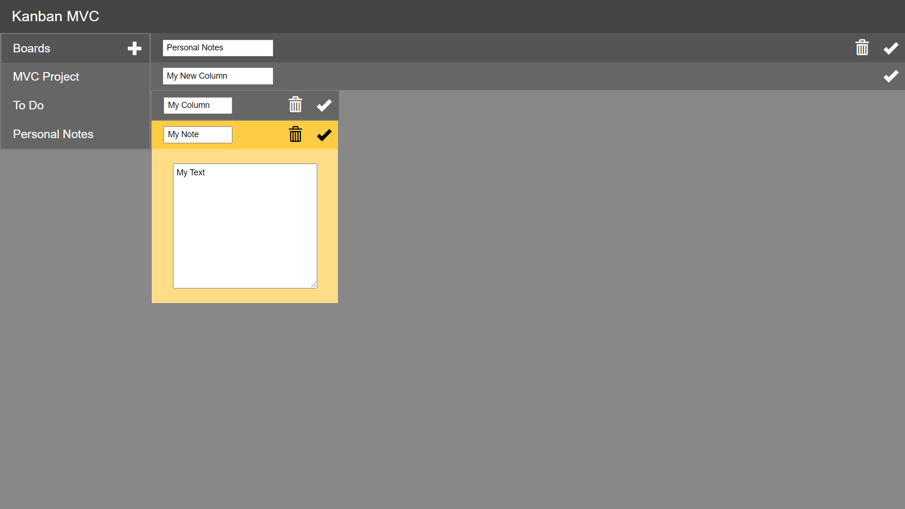

# kanban-mvc
Kanban Board implementation in ASP NET MVC, Razor and .NET Framework (legacy technologies).

## Screens

### Viewing a board

### Creating a new note

### Various inputs for editing and creation

